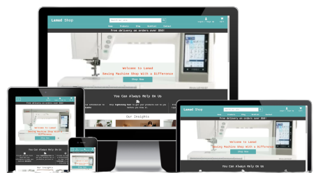
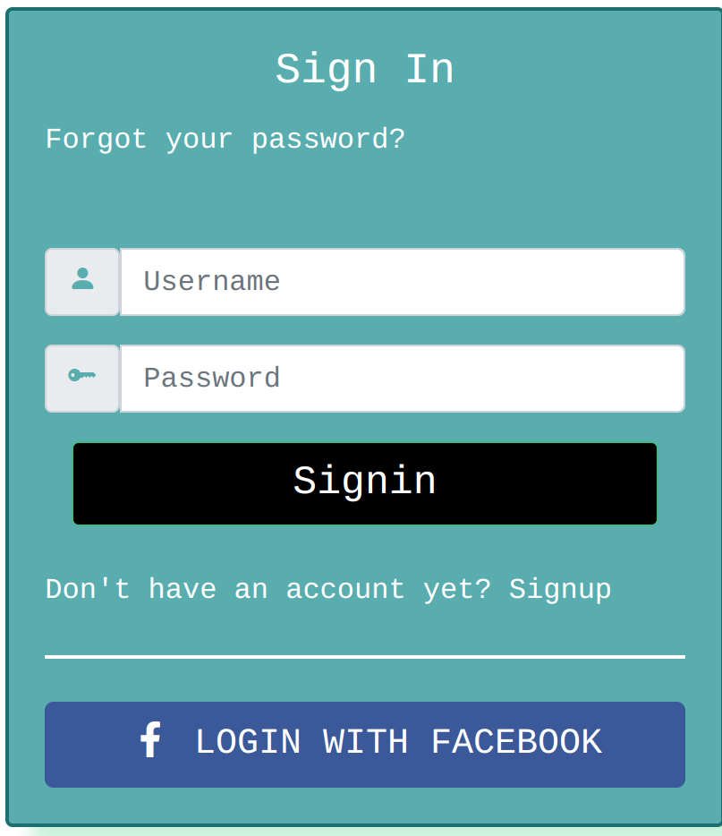
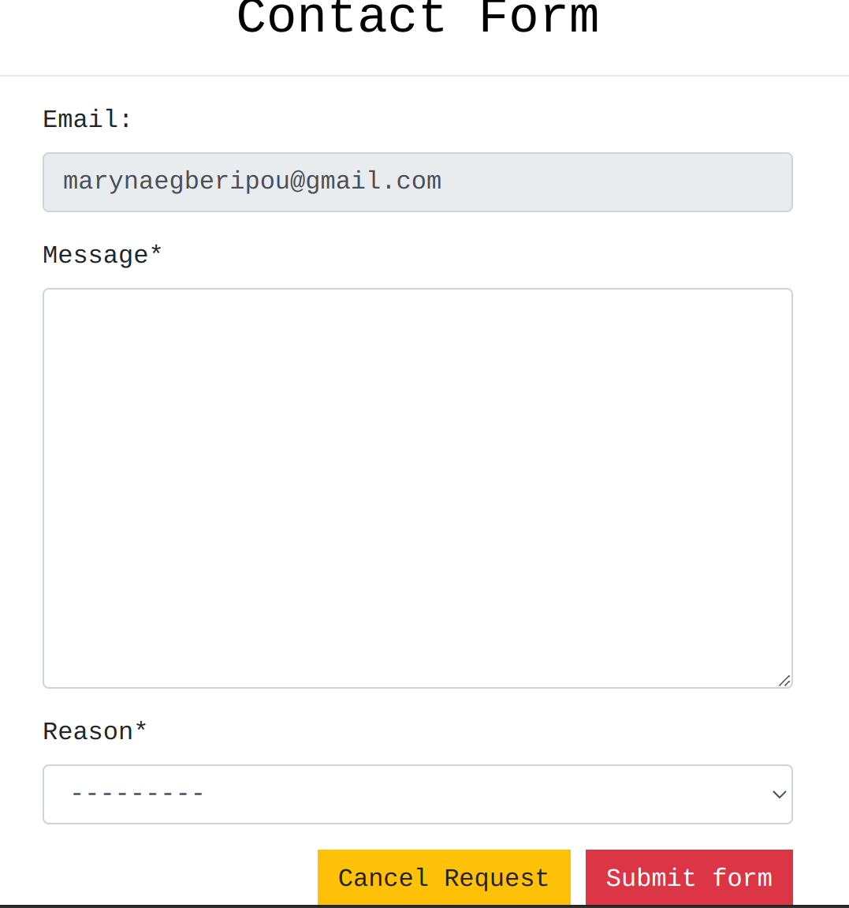
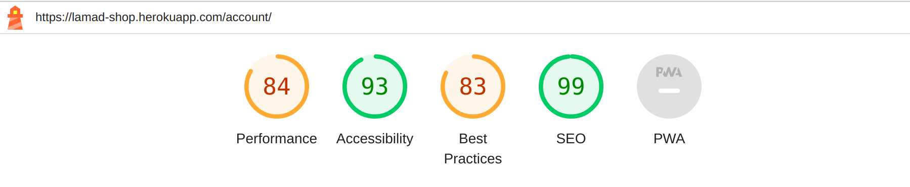

# Lamad Shop



## A Sewing machines E-commerce Store.
> A Sewing machines shop e-commerce website that provides goods for sale as well as blog content to share tips and advice.


### - By Dimie Egberipou

## **[Live site](https://lamad-shop.herokuapp.com/)    |    [Repository](https://github.com/Dee68/pp5)**

---
  
## Table of contents
<a name="contents">Back to Top</a>
 1. [ UX ](#ux)
 2. [ Business Model ](#biz)
 3. [ SEO ](#seo)
 4. [Agile Development](#agile)
 5. [ Existing Features ](#features)  
 6. [ Future Features ](#future)  
 7. [ Technology used ](#tech) 
 8. [ Testing ](#testing)  
 9. [ Bugs ](#bugs)  
 10. [ Deployment](#deployment)
 11. [ Credits](#credits)
 12. [ Content](#content)  
 13. [ Acknowledgements](#acknowledgements)  

---

## UX

<a name="ux"></a>
### Color Pallette

<details>
<summary> Color Pallete </summary>
<br>


</details>


### Database Schema

<details>
<summary> Database Structure</summary>
<br>

This was the suspected preproject planning database structure. As the project was being developed changes were made to the final project due to time contraints and project scope.


</details>

---
<details>
<summary>Accounts App</summary>
<br>

#### Account Model
| id | Field |
|--|--|
|username|CharField|
|email|EmailField|

|is_email_verified|BooleanField|

#### UserProfile Model

| id | Field |
|--|--|
|user|OneToOneField|
|street_address1|CharField|
|street_address2|CharField|
|town_or_city|CharField|
|county|CharField|
|postcode|CharField|
|country|CountryField|
|avatar|ImageField|

</details>

---

<details>
<summary>Blog App</summary>
<br>

#### Article Model

| id | Field |
|--|--|
|title|CharField|
|slug|SlugField|
|author|ForeignKey|
|updated_on|DateTimeField|
|content|TextField|
|article_image|ImageField|
|excerpt|TextField|
|created_on|DateTimeField|
|status|BooleanField|
|likes|ManyToManyField|

#### Comment Model

| id | Field |
|--|--|
|article|ForeignKey|
|body|TextField|
|created_on|DateTimeField|
|user|ForeignKey|

</details>

---

<details>
<summary>Cart App</summary>
<br>

#### Cart Model

| id | Field |
|--|--|
|cart_id|CharField|
|date_added|DateField|

#### CartItem Model

| id | Field |
|--|--|
|product|ForeignKey|
|cart|ForeignKey|
|quantity|IntegerField|
|is_active|BooleanField|

</details>

---

<details>
<summary>Checkout App</summary>
<br>

#### Order Model

| id | Field |
|--|--|
|user|ForeignKey|
|order_number|CharField|
|first_name|CharField|
|last_name|CharField|
|email|EmailField|
|phone_number|CharField|
|country|CountryField|
|street_address1|CharField|
|street_address2|CharField|
|town_or_city|CharField|
|postcode|CharField|
|county|CharField|
|date|DateTimeField|
|deliver_cost|DecimalField|
|order_total|DecimalField|
|grand_total|DecimalField|
|original_cart|TextField|
|stripe_pid|CharField|
|is_ordered|BooleanField|

#### OrderLineItem Model
| id | Field |
|--|--|
|order|ForeignKey|
|product|ForeignKey|
|quantity|IntegerField|
|lineitem_total|DecimalField|

</details>

---

<details>
<summary>Contact App</summary>
<br>

#### Contact Model

|id|Field|
|--|--|
|email|EmailField|
|message|TextField|
|reason|CharField|

</details>
  
---

<details>
<summary>Shop App</summary>
<br>

#### Category Model

|id|Field|
|--|--|
|name|CharField|
|slug|SlugField|
|friendly_name|CharField|
|description|TextField|

#### Product Model

|id|Field|
|--|--|
|name|CharField|
|slug|SlugField|
|description|TextField|
|price|DecimalField|
|stock|IntegerField|
|in_stock|BooleanField|
|has_sizes|BooleanField|
|category|ForeignKey|
|created_at|DateTimeField|
|updated_at|DateTimeField|
|image_url|URLField|
|image|ImageField|
|rating|FloatField|

#### Rating Model
|id|Field|
|--|--|
|rating|SmallIntegerField|


#### Review Model

|id|Field|
|--|--|
|product|ForeignKey|
|user|ForeignKey|
|review|TextField|
|rating|FloatField|
|created_at|DateTimeField|
  
</details>

---
<details>
<summary>Wishlist App</summary>
<br>

#### Wishlist Model

|id|Field|
|--|--|
|user|ForeignKey|
|product|ForeignKey|


</details>

---

## UX design

### Wireframes

<details>
<summary> Wireframes </summary>
<br>


</details>

[Back to Top of page](#contents)

---

# Business Model

<a name="biz"></a>

#### Business Overview

The business is a B2C e-commerce platform whose goal is to provide tangible products to it's customers through an online store.

The benefits for the business owner are:

1. Easy to scale the business as it grows
2. No need to set up a physical location
3. Can cater to customers globally
4. Can target a specific niche and try to build a brand that resonates with its target audience.
5. Relatively low cost in starting up which allows for a larger portion of the budget to be used for customer aquisition. ie Ads / marketing
6. Low price point would encourage impulse buying from customers who may be considering purchasing from the business.


The cons of this business model are:

1. Getting customers initally can be difficult due to saturation in certain industrys
2. Establishing a brand from the ground up takes time and immediate results are unlikely without a sound marketing strategy.
3. Getting customers organically takes time so the business would need to manually market the business or use paid advertising.
4. Not having a physical business can make it harder to build trust and loyalty with customers without offering discounts and offers.


Taking the pros and cons of this business, a subscription model seems to be an unlikely viable model as it requires a customer base and some form of brand loyalty.

The best approach would be to provide products on a pay as you go traditional e-commerce format. As the business grows then the implementation of a subscription model would make more sense.

---

#### Site User
User 1: The typical site user would be a male/female aged between 18 and 50 who has an interest in tailoring, clothes designing and presenting a good outfit. 

User 2: Additional site users could be partners of user 1 and may be browsing the site to purchase gifts for them.

---

####  Goals for the website
The goals for the website are:
- An easy to navigate website with clear purpose
- Provide users with products that meet their expectations
- Allow users to view, read and comment on articles that may help or interest them.
- Allow users to give their review on any product.
- Allow users to add products to a wishlist of theirs.
- To provide users with insights or tips on  machine maintenance and tips to choose the right fabrics for clothing.
- Allow users to checkout quickly and easily
- To allow users to create a profile to view past orders and update profile information

---

#### Marketing Strategy
The businesses marketing strategy going forward is:

1. Promote the store through it's facebook business page. This can be viewed in the SEO section.
2. Share the page with friends and family and ask them to like it and share the pafe to their wider circle.
3. Have a soft online launce sale to encourage early adoption and purchases from prospective clients
4. Gain subscribers through the mailchimp option on the site and then send out offers and promotions to encourage repeat business
5. Write meaningful and helpful articles / blog articles to help with SEO ranking in search engines like google.
6. Potentially use paid advertisement like google ads, facebook ads to promote to our target demographic.
7. Set up multiple ads with a different product as the cover image, track the click through rate and stick with the high peformers.
8. Depending on budget the business may look at promoting it's custom made products to influencers in the brands niche, offering complimentary goods or a small fee for a shout out  or review. Ideally targetting low to medium influencers with a following of at least 10k in target niche. This would be realistic with a low budget for the business starting off and can start pushing traffic towards the site. 

[Back to Top of page](#contents)

---

# SEO

<a name="seo"></a>

### SEO Project planning

Once the business model was decided on as an a sewing machine I started working on how to market the site and what keywords to target.

I checked for a number of keywords on semrush.com and signed up for a trial to get as much out of it as possible. From there I developed a list of short tail and long tail keywords I intended to use in this project.

### Keywords

Short-tail - Sewing Machine, Machine, Overlock Machine, Pfaff Coverlock, Coverlock machine,Tailoring, Fabrics, Clothes

long-tail -  dress making ,  clothes designing,  clothes alteration, gift for a tailor,
maintenance of sewing machine

By utilising the short tail keywords and analysing the results from google trends, and the related questions I was able to generate a list of longtail keywords.
The keywords are used throughout the site at different places.

I make use of the <strong>Strong</strong> tag where necessary and ensure all links are described correctly.

### Sitemap.xml
I generated a sitemap for the site so that once ready engines like google can search it effectively.

### Robots.txt
I generated a robots.txt file so that google could crawl the site. I have blocked off the accounts app as there is no benefit for google to crawl those pages.

### Logo
The logo of the site was made with an online app from LOGO(logo.com)

### Facebook Business Page

To view the facebook business page you can click on the link below:

[Facebook Business Page](https://www.facebook.com/profile.php?id=100091956826416)

In case the page becomes inactive or deactivated by Facebook I have taken screenshots to display here also:

<details>
  <summary>Facebook Business Page Screenshots</summary>
  <br>


</details>

[Back to Top of page](#contents)

---

## Agile Development

<a name="agile"></a>

### Agile Overview
Once I had an initial idea of the website I was going to build I started the preplanning by creating a github projects page to track the epics, user stories and tasks required to work through for this project.

As I worked through the workload I moved tasks from not started to in progress to completed once the task was done. Occasionally I would find other work that were either new tasks or subtasks that required attention before completing a larger task.

I also documented some of the bugs I have come across on this project in the projects board.


### Github Project Board
To see the final project board for Lamad Shop you can click the link below:
[Lamad Shop Project Board](https://github.com/users/Dee68/projects/12)


#### Epics
 1. [Epic: Navigation & Views](https://github.com/Dee68/pp5/issues/33)
 2. [Epic: Admin & Stock Management](https://github.com/Dee68/pp5/issues/30)
 3. [Epic: Payment](https://github.com/Dee68/pp5/issues/16)
 4. [Epic: Deploy Project](https://github.com/Dee68/pp5/issues/36)
 5. [Epic: Contact](https://github.com/Dee68/pp5/issues/35)
 6. [Epic: User Authentication](https://github.com/Dee68/pp5/issues/31)
 7. [Epic: Readme](https://github.com/Dee68/pp5/issues/29)
 8. [Epic: SEO](https://github.com/Dee68/pp5/issues/37)
 9. [Epic: Shopping Cart](https://github.com/Dee68/pp5/issues/38)

Each Epic may have one or more user stories associated and each user story may have tasks.

The full breakdown of user stories and tasks are included on the project board above.


[Back to Top of page](#contents)

---

## Existing Features

<a name="features"></a>

<details>
<summary> Navigation </summary>
<br>

The Desktop navigation was based on Boutique Ado and seemed like a concise and clear option for an e-commerce store. 


Mobile Navigation
  


  
When developing this application I decided I wanted to add a detailed footer as would be found on most e-commerce websites.


</details>

<details>
<summary> Authentication </summary>
<br>

The authentication flows come from a Custom user model inherited from django abstractuser model and have been styled to fit the theme of my website. At present when a user signs up a confirmation email is sent to their email address to confirm it before being able to access their account.Username field, email field and password field are required fields to enable a user to signup.The username and email fields are validated using ajax for a better user experience. Refraining from using the django-allauth library was a personal choice to try and understand how the best brains that built this library came about it.


A registererd user can login with his/her a username and password



</details>

<details>
<summary> Account Profiles </summary>
<br>

The account profiles model was designed to make it easy for customers to carry out some basic post order options. 
The facility to update their account information, change their shipping address or profile photo. Even close their account if they no longer wish to have one.


We allow users to add and update their profile image as we display their image beside their username when they make comments on blog posts. 
This was intended to create some form of personalisation and encourage people to discuss on the websites soon to be many topics.


The customer can visit their order confirmation by clicking on the order number in the order history page. Once directed to this page they will be notified by a pop up message that this is displaying a previous order and not a new one.
  
The customer can return to the profile by clicking on the button below the order form.


</details>

<details>
<summary> Products Page </summary>
<br>

The products page is responsive to allow equal spacing between products regardless of screen width. The products page is paginated and shows a add review button for logged in users.
  
Out of stock products do not show up to customers but in the event that the customer somehow gets access to a product that is out of stock, the add to card button is disabled to prevent out of stock purchases.

Users can not also purchase products more than what is in stock
  


The product detail page includes a review and wishlist options but can only be accessed by logged in users.
The logged in user can add a review with a rating that spans from 1 to 5 and can add the product to his/her wishlist.This page also shows the number of reviews made on the product.


</details>

<details>
<summary> Cart & Checkout Flow </summary>
<br>

Only logged in users can access the cart page with cart items.
Non logged in user is notified to signup and signin in other to purchase products.
The cart page displays the cart items with the product image, price, quantity and the number of individual items in the cart.
On the navigation bar cart icon shows the number of cart items in the cart.


On filling the checkout form with a valid data, the user will be sent an email to confirm his/her order.


  
Once the customer makes a successful paymeent they are redirected to the payment success page where they see a summary of their order. 

</details>


<details>
<summary> Review </summary>
<br>

A logged in user can make review of any product with a rating range of 1 to 5 he/she wishes.
He/she can also update and delete his/her review.
Non logged in user can only read the reviews of logged in users.


</details>

<details>
<summary> Wishlist </summary>
<br>

The wishlist is only availabe for logged in users.A logged in user can add or delete a product to this list.


</details>

<details>
<summary> Blog </summary>
<br>

The idea behind blogs was to firstly create informative and helpful articles to boost SEO and also to create a place for users to ask questions, share insights and converse with like minded people.  


  
The blog articles page displays articles written by the admin user. Blog comments can be viewed by all users but only logged in users can comment on the articles.


</details>

<details>
<summary> Contact Page </summary>
<br>


  
The contact form was designed to be a model that sends the message to the backend of the website. Non logged in users are not permitted to view this page.


The contact form specifies the reason for contact as shown in the dropdown list.


</details>


<details>
<summary> Account Notifications </summary>
<br>

When a user signs in or out they see a notification like the below to indicate this with the relevant action just taken.


If a user navigates from their account profile to the below link they are notified as it is reusing the same payment confirmation page once the user makes an order and pays.


When a user adds an item to cart they see the below notification.
  


</details>

<details>
<summary> Admin related permissions </summary>
<br>

When the superuser logs into the account they have additional front end permissions to edit, delete and add products to the website.
The edit option and delete options are available on the products page and the add product option is on the product management page on the my account dropdown.


</details>


<details>
<summary> Additional Pages </summary>
<br>

To ensure the page reflects that of a genuine e-commerce page I wanted to include shipping policy's, return policy's and FAQ's to ensure customers common queries are available.
  


  
A subscribe option for customer to provide their emails to be added to mailing lists for offers tips and tricks. This service is provided by mailchimp.
  


</details>


#### Account restrictions:

When an unverified or not logged in user trys to access the accounts section of the site they are notified they do not have permissions.

<details>
<summary>Restrictions</summary>
<br>


</details>


[Back to Top of page](#contents)

---

<a name="future"></a>
## Future Features 

### Future features to add to improve user interface would be:

- Features including allowing users to reply directly to each other through blog       
  articles, possible even add threads that users can generate themselves to increase and develop a community.
  I would also like to add a notification system for users to be able to see replys, likes in a bell icon from their account.


- In future iterations I would implement a Frequently added products section that      
  would present itself on the initial cart page before checkout to help drive upsells.


- As I have a dropdown model for the contact form, depending on the size of the       
  business I would like to forward the emails to specific email addresses monitored by different staff departments. For example the complaints emails go to the complaints teams to ensure quick responses and reduce friction.


- Going forward I would like to add an order tracking system for the user profile 
  section. Once order placed the merchant can move the product to dispatched and add tracking that can then be viewed by the customer from within their account and also receive an email with the updates.


- This would involve creating a front end accounts page to display orders and graphs 
  for employees of the business beyond django cms. 
  These would allow the business to track orders over days, months and year on year as well as track most popular products.

[Back to Top of page](#contents)

---

<a name="tech"></a>
##  Technology Used

### Html

 - Used to structure my website

### CSS

 - Custom CSS was written on large chunks of this site to make it as close to the wireframes as I felt it needed to be.

### JavaScript

 -  Used to add timeout function for messages as well as to enable the menu on index.html

### Python

 -  Used for the logic in this project.

### Django

 -  Framework used to build this project. Provides a ready installed admin panel and includes many helper template tags that make writing code quick and efficient.

### Font Awesome

 -  Icon library used

### Bootstrap 4
 - Used as the base front end framework to work alongside Django

### Jinja Templating with Django
 - Used to render logic within html documents and make the website more dynamic.

### GitHub
 - Used to store the code for this project & for the projects Kanban board used to complete it.

### Heroku
 - Used to host and deploy this project

### Heroku PostgreSQL
 - Heroku PostgreSQL was used as the database for this project during development and in production.

### Git
- Used for version control throughout the project and to ensure a good clean record of work done was maintained.

### AWS S3 and IAM
- Used to host static and media files for this project and IAM for the permissions based roles for accessing the S3 buckets.

### Django-Crispy-Forms
- Used to style some of the forms in this project.

[Back to Top of page](#contents)

---

<a name="testing"></a>
## Testing


### Testing Phase


### Unit Test
  - Due to the limited time for the project only a few unit test was implemented

<details>
<summary>Account App Tests </summary>
<br>


</details>

---

#### Manual Testing

> If the intended outcome completes then this will be flagged as pass. If it does not then this is a fail.


<details>
<summary>Account Registration Tests </summary>
<br>

| Test |Result  |
|--|--|
|User can create an account | Pass |
|Verified User can log into account| Pass|
|User can log out of account|Pass|
|User is notified of logging in to account|Pass|
|User is notified of logging out of account|Pass|
|User receives email verification email|Pass|

</details>

---


<details>
<summary>Account Login Tests </summary>
<br>

| Test |Result  |
|--|--|
|Verified User can log into account| Pass|
|Non verified User is notified to check email|Pass|
|User can log out of account|Pass|
|User is notified of logging in to account|Pass|
|User is notified of logging out of account|Pass|
|User can log in with facebook credentials|Pass|

</details>

---

<details>
<summary>User Navigation Tests</summary>
<br>

| Test |Result  |
|--|--|
|User can navigate to product| Pass |
|User can access product details| Pass|
|User can add a product to cart|Pass|
|User can navigate back to products|Pass|
|User can add additional products to cart|Pass|
|User can add multiple quantities of a product |Pass|
|User can navigate to cart|Pass|
|Logged in User can navigate to the profile section of accounts|Pass|
|User can access their saved address information|Pass|
|User can access past orders|Pass|
|User can access the blog section of the page|Pass|
|User can access specific blogs|Pass|
|User can access the contact page and form|Pass|
|User can access the review page|pass|
|Logged in User can review any product|pass|
|Logged in User can edit or delete their reviews|pass|
|Logged in User can add to his/her wish list|pass|
|All links on footer open to correct pages|Pass|
|All links on Heading Navigation open to correct option|Pass|

</details>

---

<details>
<summary>Account Security Tests</summary>
<br>

| Test |Result  |
|--|--|
|Not logged in User cannot make review | Pass |
|Not logged in User cannot access profile page| Pass|
|Not logged in User cannot access admin panel|Pass|
|Not logged in User cannot access products management|Pass|
|Not logged in User cannot access the contact form page|Pass|
|Not logged in User cannot leave comments on blog|Pass|
|Logged in User cannot access admin panel|Pass|
|Logged in User cannot access products management|Pass|
|Logged in User can access the contact form page|Pass|
|Logged in User cannot edit products|Pass|
|Logged in User can leave comments on blog articles|Pass|

</details>

--- 

<details>
<summary>Profile Tests</summary>
<br>

| Test |Result|
|--|--|
|Not logged in User cannot access profile page | Pass |
|Logged in User can access profile page|Pass|
|Logged in User can see their details on the accounts home page|Pass|
|Logged in User can update their first name|Pass|
|Logged in User can update their last name|Pass|
|Logged in User can update their email|Pass|
|Logged in User can navigate to their shipping information|Pass|
|Logged in User can update street address 1 and 2|Pass|
|Logged in User can update town or city|Pass|
|Logged in User can update county|Pass|
|Logged in User can update postcode|Pass|
|Logged in User can update country|Pass|
|Logged in User can navigate to change profile image page|Pass|
|Logged in User who does not have a personal image has the default image|Pass|
|Logged in User can add an image to their profile|Pass|
|Logged in User can change their profile image once they have one set |Pass|
|Logged in User can remove a personal image entirely |Pass|
|Logged in User can select delete account|Pass|
|Pop-up modal prompts the user to confirm sign out before signing out|Pass|
|Pop-up modal prompts the user to confirm account deletion before closing account|Pass|
|Logged in User can close account successfully |Pass|
|When user closes their account they are redirected to the home page|Pass|
|When user closes account they receive a pop up notification advising them the account is closed|Pass|

</details>

---

<details>
<summary>Admin Tests</summary>
<br>

| Test |Result  |
|--|--|
|Super User can access admin panel from the my account dropdown | Pass |
|Super User can access add product page from my account dropdown|Pass|
|Super User can see the edit product option on the products page|Pass|
|Super User can see the delete option on the products page|Pass|
|Super User can write blogs from the admin panel and publish them|Pass|
|Super User can edit products and update all fields successfully|Pass|
|Super User can delete products from the products page|Pass|

</details>

---

<details>
<summary>Site wide tests</summary>
<br>

| Test |Result  |
|--|--|
|Not logged in User cannot access contact page| Pass |
|Not logged in user cannot access wishlist page|Pass|
|Logged in user can add a review to product of choice|Pass|
|Logged in User can submit contact form to website|Pass|
|Super User can view submitted forms from the admin panel|Pass|
|Logged in User receives notification the form has been submitted|Pass|
|User can navigate to privacy policy|Pass|
|User can navigate to shipping policy|Pass|
|User can navigate to terms of use page|Pass|
|Social links open up to the correct pages|Pass|
|Social links open up in a new tab|Pass|

</details>

---

<details>
<summary>Payment Tests</summary>
<br>

| Test |Result  |
|--|--|
|Not logged in User is notified to signup before making a purchase| Pass |
|Logged in User can successfully make a payment & order| Pass|
|All logged in users receive an email confirmation of order on deployed site|Pass|
|In development email confirmation is printed to terminal|Pass|
|In production email confirmation is sent to user|Pass|
|If payment is successful user will be redirected to order success page|Pass|
|If order fails due to incorrect information being submitted order will not be submitted|Pass|
|If there is an error when processing the order the site returns a 500 error without processing order|Pass|

</details>

---

<details>
<summary>Blog Tests</summary>
<br>

| Test |Result  |
|--|--|
|Not logged in User can access blog pages| Pass |
|Not logged in User cannot post a comment on blog posts|Pass|
|Logged in User can comment on blog posts|Pass|
|Logged in User can like blog posts|Pass|
|Logged in User information shows in the comment section after they post comment|Pass|
|Logged in User correct profile image shows on the comment they made|Pass|
  
</details>

---

## Google Lighthouse Testing

### Desktop

> index.html

<details>
  <summary>Index.html Screenshot</summary>
  <br>


  
  </details>

> product.html

<details>
  <summary>Product.html Screenshot</summary>
  <br>
  

  
  </details


> blog.html

  <details>
  <summary>Blog.html Screenshot</summary>
  <br>
  

  
  </details


> profile.html

<details>
  <summary>Profile.html Screenshot</summary>
  <br>
  

  
  </details

## HTML W3 Validation

### index.html

<details>
  <summary>W3 HTML Validation Screenshot</summary>
    </br>


  
  </details>
  
#### Result: No Errors

### CSS Validation

<details>
  <summary>W3 CSS Jigsaw Screenshot</summary>
  </br>
  


</details>

#### Result: No Errors

[Back to Top of page](#contents)

---

<a name="bugs"></a>
## **Bugs**

<details>
<summary>Bugs</summary>
<br>

> Please click on the bugs below to see causes, solutions or reason why issue is not resolved

| Bug |Outcome  |
|--|--|
|[User purchasing more than product quantity in stock](https://github.com/Dee68/pp5/issues/39)| Resolved |
|[Email verification error](https://github.com/Dee68/pp5/issues/32)|Resolved|
|[ Anonymous User checkout returning 500 error page](https://github.com/Dee68/pp5/issues/40)|Resolved|
|[Empty input field error](https://github.com/Dee68/pp5/issues/47)|Resolved|


</details>


[Back to Top of page](#contents)

---

<a name="deployment"></a>
## Deployment

### Deployment to Heroku

This application is deployed with Heroku.

<details>
  <summary>The steps for deploying through Heroku are as follows:</summary>
  <br>

1.  Visit Heroku and login
2.  Click on New and then choose New App.
3.  Choose a name for your app and then choose your region.
4. Ideally select the region closest to you
5.  Then press 'Create app'.
  
</details>


<details>
  <summary>To attach The Database:</summary>
  <br>

1. Login or sign up to  [ElephantSQL](https://www.elephantsql.com/).
2. Press create a new instance.
3. Choose a name and plan. Then click on select region. 
4. Select the closest Data Center to you
5. Click on "Create Instance".
6.  Go back to the start page and click on your new database.
7.  Copy the URL for the database.
  
 </details>


Go back to Heroku and click on the settings tab of your application.
    
Click on "Reveal config vars".

Add a new config var named DATABASE_URL and paste in the URL from  ElephantSQL  as the value.

Go back to Gitpod or the IDE you are using and install two more requirements for the database:

  `pip3 install dj_databse_url`
  `pip3 install psycopg2-binary`
  
Update your requirements.txt file by typing in  `pip3 freeze --local > requirements.txt`

Add the DATABASE_URL to your env.py file or environment variables in gitpod.

Go to settings.py and  `import dj_database_url`

Comment out the default  `DATABASES`  setting.

Add this under the commented out section:

``` DATABASES = {
    'default': dj_database_url.parse(os.environ.get('DATABASE_URL')) }

```
Run migrations for the new database.

1.  In the root directory of your project, create a file called "Procfile" and add  `web: gunicorn project_name.wsgi`  so Heroku will know what kind of application it is.
    
2.  In settings.py add ['app_name.heroku.com', 'localhost'] to  `ALLOWED_HOSTS`.
    
3.  Commit and push these changes to GitHub.
    
4.  In the Heroku settings tab of your project update the config vars to the following:

| Key | Value  |
| -- | -- |
|AWS_ACCESS_KEY_ID|From AWS in CSV Download|
|AWS_SECRET_ACCESS_KEY|From AWS in CSV Download|
|DATABASE_URL|From ElephantSQL dashboard|
|EMAIL_HOST_PASSWORD|App Password from Email Client|
|EMAIL_HOST_USER|Email address|
|SECRET_KEY|Randomly Generated Django Key|
|STRIPE_PUBLIC_KEY|Publishable key from Stripe Dashboard|
|STRIPE_SECRET_KEY|Secret key from Stripe Dashboard|
|STRIPE_WH_SECRET|Signing secret from Stripe Webhooks Endpoint|
|USE_AWS|True|

If you deploy at the beginning of the project then add the key value of: `DISABLE_COLLCETSTATIC`  and set it to 1. When you have  staticfiles to push then remove this variable.

Once the project is completed and you are no longer working on it set  `DEBUG`  =  `False`  in settings.py.

Log in to Heroku and select the deploy tab on your Heroku App and connect your GitHub account.

Search for your repository and connect it.

Once you have selected the correct repository, scroll down and click "Deploy Branch".

Watch the log as it deploys your project and ensure there are no errors.

If everything is correct it should deploy successfully.

Click on open app at the top of the page to view your deployed app.

---

### Clone project

<details>
  <summary>How to clone of the repository:</summary>
  <br>

1.  Click on the code tab under the repository name.
2.  Then click on "Code" button to the right above the files listed.
3.  Click on the clipboard icon to copy the URL.
4.  Open Git Bash in gitpod or your preferred IDE.
5.  Change the working directory to where you want your cloned directory.
6.  Type  `git clone`  and then paste the URL that you copied.
7.  Press enter and clone is complete.
8.  In the terminal install the requirements by using the following: pip3 install -r requirements.txt
9. Next create the env.py file which tells our project which variables to use.  
10. Add the file to a .gitignore to prevent it from being pushed to github
11. Make migrations by running :  `python manage.py makemigrations`
12. Then migrate those changes with  `python manage.py migrate`
13. To run the project type  `python manage.py runserver` into the terminal and open port 8000.
14. This will open the project locally for you to work on.
  
  </details>

---

#### Forking the repository on GitHub

The steps to fork this repository are:

 1. Login to github and find the respitory  [here](https://github.com/dee68/pp5)
 2. Under your profile photo on the right hand side you will see the fork button.
 3. Click the fork button and github will create a copy to your account.


[Back to Top of page](#contents)

---
  
<a name="credits"></a>
## Credits

#### Code Institute
  - Course content for portfolio project 5 helped greatly in being able to complete this project.
  - Setting up an ecommerce project template
  - Implementing payment with stripe api was explained and made simple.

#### Cryce Truly
  - Cryce youtube videos are very informative and well paced to understand the basics of writing unit test.

#### Vitor Freitas(Simpleisbetterthancomplex.com)
  - Very informative articles on how to extend Django user model diversely.

##### Rathan Kumar
  - A slightly different approach to creating an ecommerce website. 
  - combining Rathan videos with the course content of code institute gives you good enough skill to complete the project.

##### Chat GPT
  - For this project I had personally written 3 blog articles focusing on SEO and related to the niche of this project.
  - To save time and also to try out some AI resources I have used ChatGPT to write my blog articles. 
  - These articles were not written by myself.
  - I provided the title of the article and instructed the AI application to write a blog related article for a sewing machine e-commerce shop.
  - The final articles were off and requires some tweeking to make sense and then were formatted for this site.

##### Remove.bg
  - Used remove.bg to remove the background on the amires.png as i felt the original black background didn't work with the readme layout.
  - The new image fits in nicely and is more aestetically pleasing for readers.
  
[Back to Top of page](#contents)

---

<a name="content"></a>
## Content & Resources
  
##### Django Documentation
  - Read through the django documentation multiple times when trying to implement models and other content.
  
##### W3 Schools
  - Used for reference throughout for simple css examples.
  - Used for reference to create accordion
  
##### Code Institute
  - Course content for portfolio project 5 helped greatly in being able to complete this project.
  - I found the walkthroughs informative and well paced.
  - Some legacy code regarding nav remains.

##### Alan Bushell
  - Alan's portfolio project 5 project models and in particular the layout of the readme.
 

##### Geek4Geeks
  - Really good resource for tutorials and guides relating to all forms of programming. Really helpful for templating or sythax reference.


[Back to Top of page](#contents)

---

<a name="acknowlegements"></a>
## Acknowledgements

### Jack Wachira
> My mentor who provided me with constructive feedback and guidance throughout.

### Irene Neville
> My code institute facilitator in keeping up with my schedule.

### Collegues
> For advices and testing my website.


[Back to Top of page](#contents)
